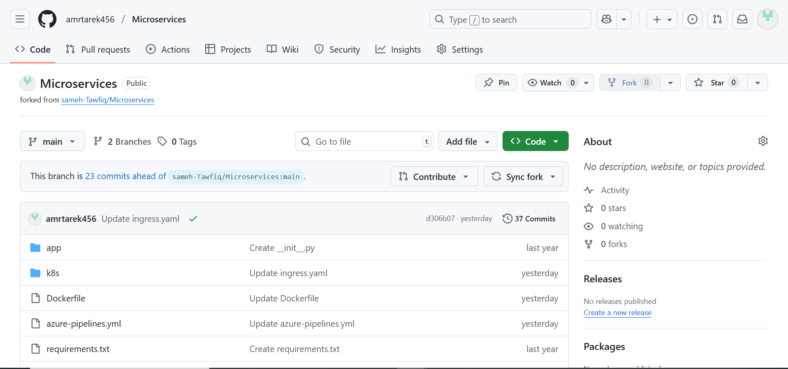
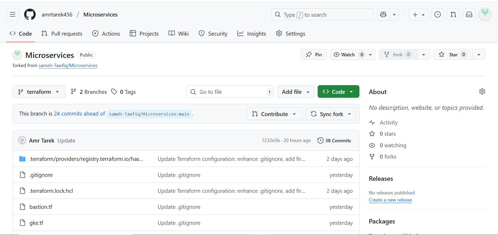
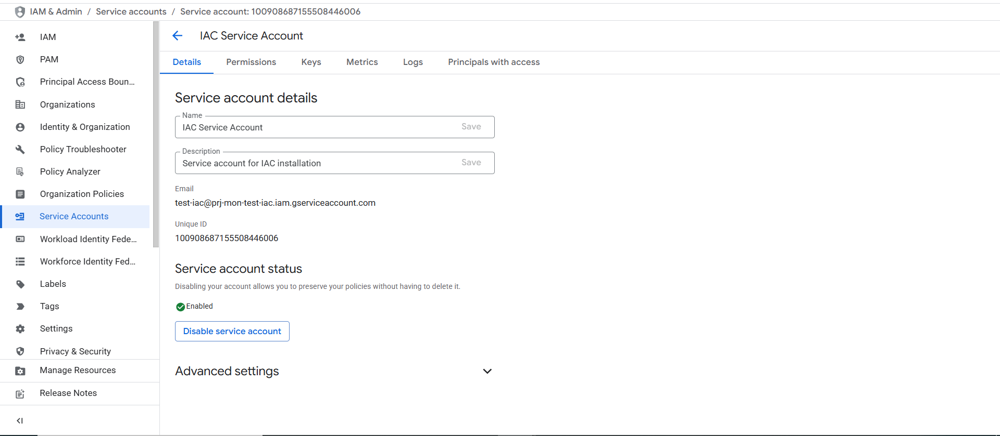
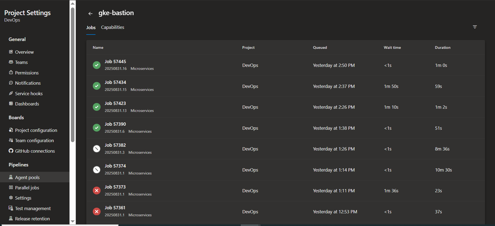
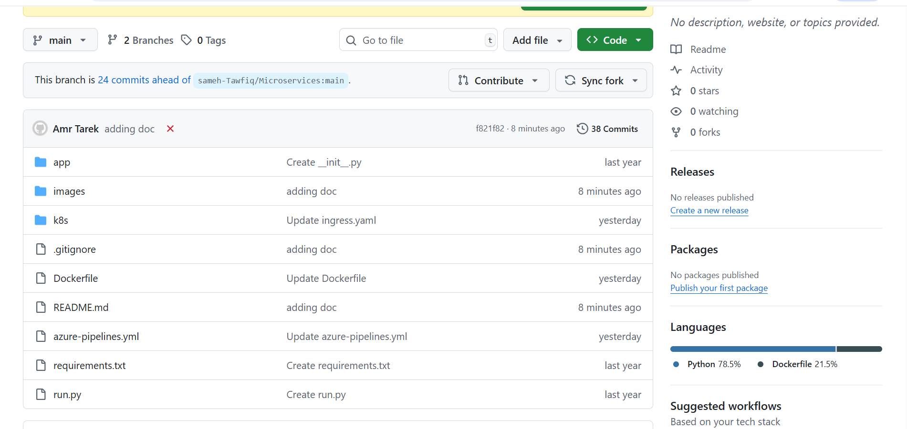
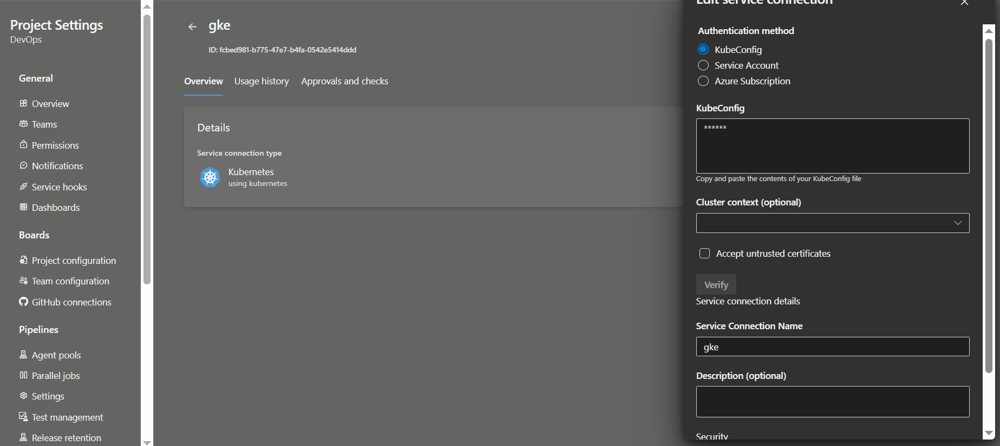
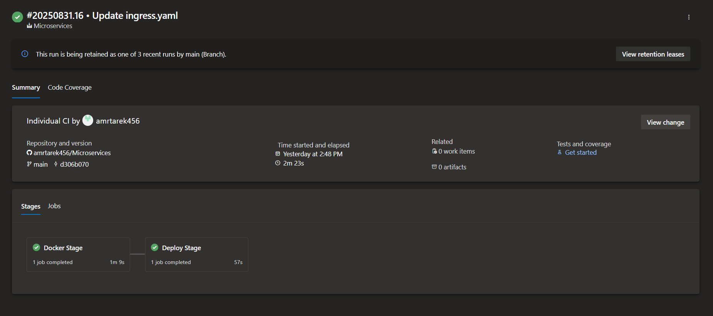
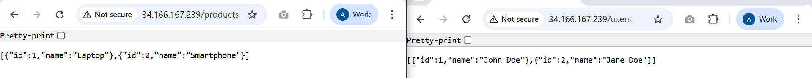
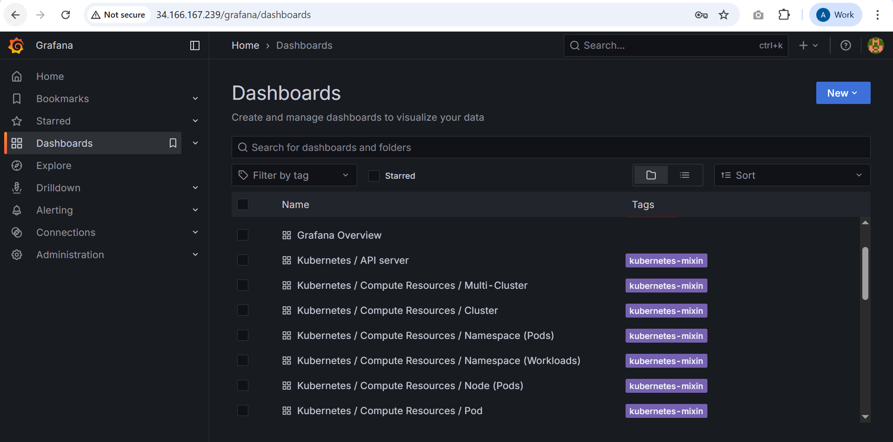
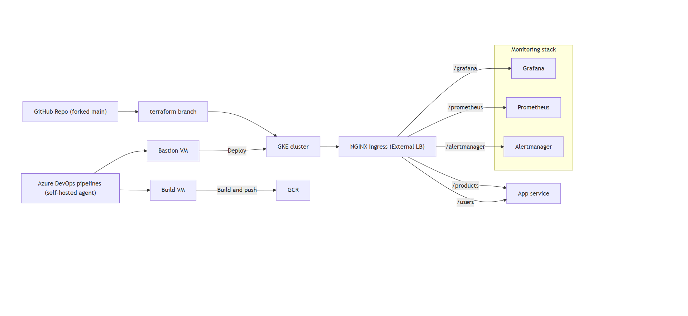

# GKE Deployment with Terraform, Azure DevOps, and Monitoring Stack

This repository demonstrates how to provision a **Google Kubernetes Engine (GKE)** cluster using **Terraform**, deploy applications through **Azure DevOps pipelines** (self‑hosted agent on a bastion VM), and set up monitoring with **Prometheus** and **Grafana** via **NGINX Ingress**.

---

## 🚀 Steps to Reproduce

### 1) Fork the Repository
Fork this repository into your own GitHub account to start customizing it.  


---

### 2) Create a `terraform` Branch
Create a new branch named `terraform` that will contain all Terraform files.

```bash
git checkout -b terraform
```


---

### 3) Create a GCP Service Account & JSON Key
Create a **Service Account** in Google Cloud and generate a **JSON key** so Terraform can authenticate to GCP APIs.  
> Keep your key secure. Optionally export it for Terraform:
> ```bash
> export GOOGLE_APPLICATION_CREDENTIALS="/path/to/key.json"
> ```


---

### 4) Run Terraform
From the `terraform` branch (inside your Terraform directory), run:

```bash
terraform fmt -recursive
terraform init
terraform validate
terraform plan
terraform apply -var-file=terraform.tfvars
```

---

### 5) Verify the GKE Cluster
SSH to the **bastion VM** and verify the cluster nodes:

```bash
kubectl get nodes
```
---

### 6) Install Azure DevOps Self‑Hosted Agent (on the bastion)
Install the agent that will deploy to the private GKE cluster:

```bash
wget https://download.agent.dev.azure.com/agent/4.260.0/vsts-agent-linux-x64-4.260.0.tar.gz
mkdir myagent && cd myagent
tar zxvf vsts-agent-linux-x64-4.260.0.tar.gz
./config.sh
./run.sh
./svc.sh install
./svc.sh start
```


> After this, your Azure DevOps pipelines can target the cluster through this agent.

---

### 7) Main Branch Contents
The **`main`** branch contains:
- Application source code
- `Dockerfile`
- `azure-pipelines.yml`
- Kubernetes manifests (`k8s/`)


---

### 8) Create Google Container Registry (GCR)
Create a **GCR** repository to push Docker images from the pipeline.  

---

### 9) Azure DevOps Service Connections
Create **Service Connections** in Azure DevOps for:
- **GCR** (push images)
- **GKE** (deploy to cluster)


---

### 10) Install NGINX Ingress Controller
Install NGINX Ingress with an external LoadBalancer to expose services:

```bash
kubectl create ns ingress-nginx
helm repo add ingress-nginx https://kubernetes.github.io/ingress-nginx
helm repo update
helm install ingress-nginx ingress-nginx/ingress-nginx -n ingress-nginx
kubectl -n ingress-nginx get svc ingress-nginx-controller
```

---

### 11) Run the Pipeline
Trigger the Azure DevOps pipeline to build, push, and deploy. The app will be deployed into the **`microservice`** namespace.  


---

### 12) Test Application Endpoints
Access the application through the ingress and verify:
- `/products`
- `/users`


---

### 13) Install Prometheus & Grafana (Kube Prometheus Stack)

Create a file named **`kps-values.yaml`**:

```yaml
grafana:
  enabled: true
  service:
    type: ClusterIP
    port: 80
  ingress:
    enabled: true
    ingressClassName: nginx
    path: /grafana
    pathType: Prefix
  grafana.ini:
    server:
      root_url: "http://34.166.167.239/grafana"
      serve_from_sub_path: true

prometheus:
  ingress:
    enabled: true
    ingressClassName: nginx
    paths:
      - /prometheus
    pathType: Prefix
  prometheusSpec:
    routePrefix: /prometheus
    externalUrl: "http://34.166.167.239/prometheus"

alertmanager:
  ingress:
    enabled: true
    ingressClassName: nginx
    paths:
      - /alertmanager
    pathType: Prefix
  alertmanagerSpec:
    routePrefix: /alertmanager
    externalUrl: "http://34.166.167.239/alertmanager"
```

Install with Helm:

```bash
kubectl create ns monitoring

helm repo add prometheus-community https://prometheus-community.github.io/helm-charts
helm repo update

helm install kps prometheus-community/kube-prometheus-stack \
  -n monitoring -f kps-values.yaml
```

---

### 14) Retrieve Grafana Admin Credentials

```bash
# Username (usually 'admin')
kubectl -n monitoring get secret kps-grafana \
  -o jsonpath='{.data.admin-user}' | base64 -d; echo

# Password (random unless you set it)
kubectl -n monitoring get secret kps-grafana \
  -o jsonpath='{.data.admin-password}' | base64 -d; echo
```


---

## ✅ Final Outcome
- GKE cluster provisioned with **Terraform**
- CI/CD via **Azure DevOps** self‑hosted agent
- Services exposed through **NGINX Ingress**
- **Prometheus** & **Grafana** for observability

---

## 📊 Architecture Diagram





